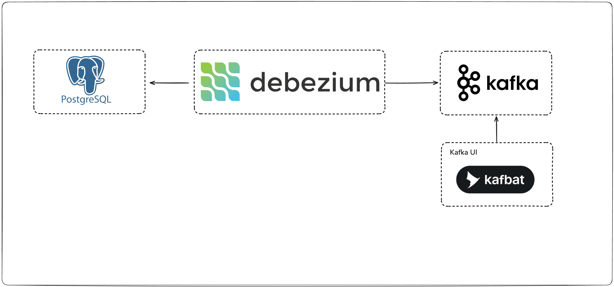

# Debezium experiments

This repository contains experiments and learning materials related to Debezium, an open-source platform for change data capture (CDC). Debezium allows you to monitor and capture changes in databases in real-time and stream them to various systems like Apache Kafka.

## Simple PostgreSQL CDC with Debezium and Kafka



### Structure

- PostgreSQL 17-alpine
- Debezium version 3.3.0.Final
- Kafka
- Kafka UI

### Getting Started

To get started with the experiments, follow these steps:

#### Clone the repository

```bash
git clone https://github.com/akmalovaa/debezium-learn.git
```

#### Run Docker Compose

> **Warning for macOS (ARM) users**: Debezium Connect images are not available for ARM architecture

```bash
docker-compose up -d
```

#### Create Debezium Connector

```bash
chmod +x create-connector.sh
./create-connector.sh
```

#### Open Kafka UI

Access Kafka UI at [http://localhost:8080](http://localhost:8080) to monitor Kafka topics and messages.

#### Add new messages to the database

You can add new messages to the PostgreSQL database using SQL INSERT statements. Here are some examples

```sql
INSERT INTO messages (username, message_text) VALUES 
    ('tututru', 'New message for Debezium testing!'); 
```

### Explore Debezium

Once you have added messages to the database, you can explore how Debezium captures these changes and streams them to Kafka topics. Use Kafka UI to view the messages in the relevant topics.

## TO DO

- Add Python app consumer example
- Outbox pattern example
- Additional Debezium configurations and optimizations
- Error handling and recovery scenarios
- Monitoring and alerting setup for Debezium and Kafka
